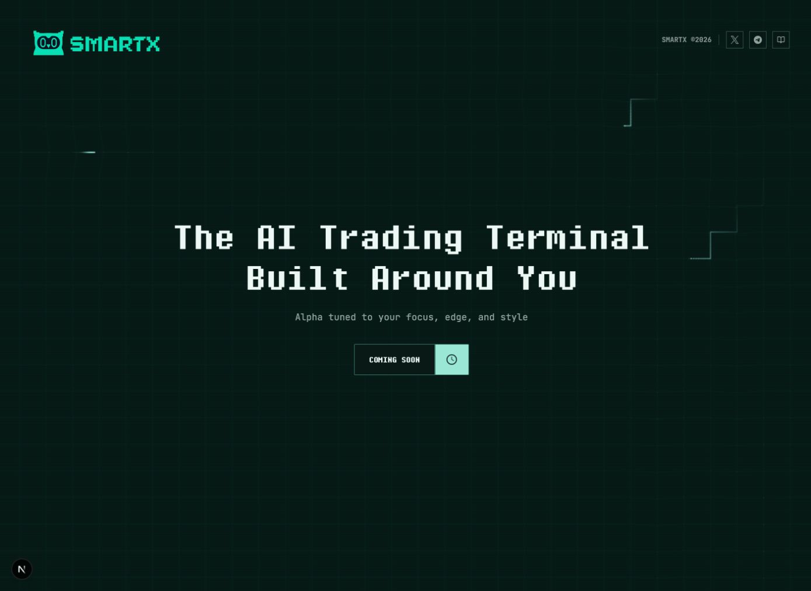
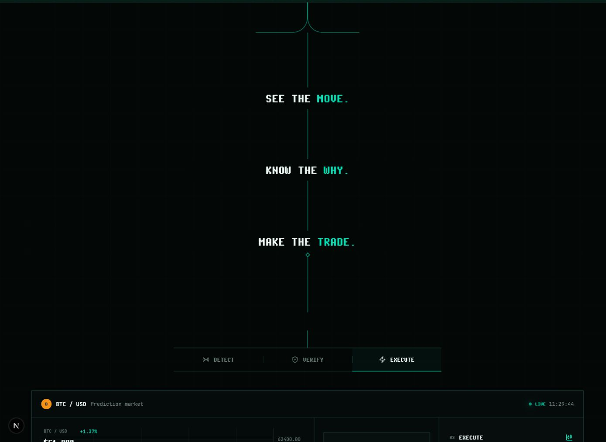
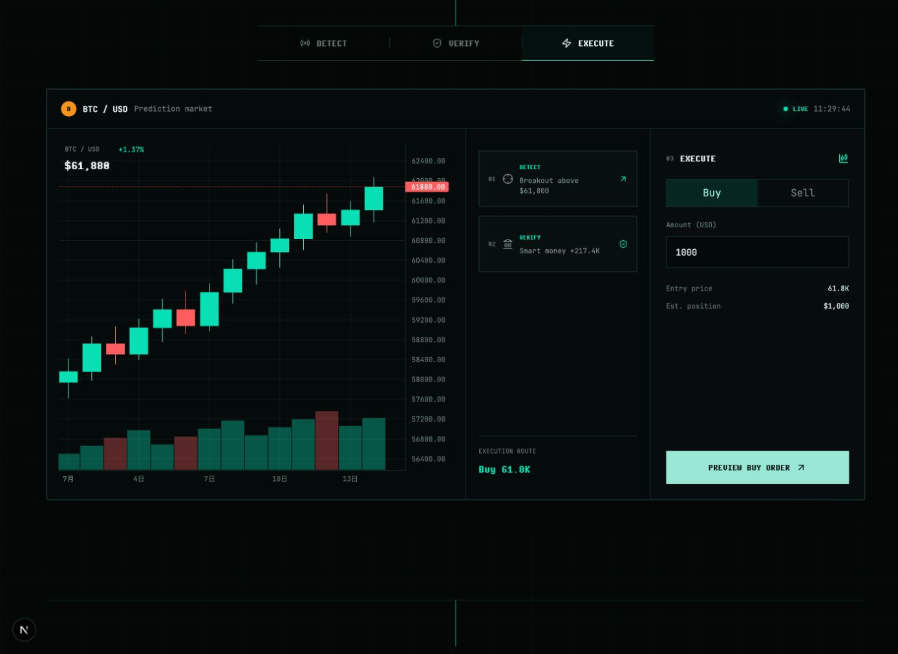
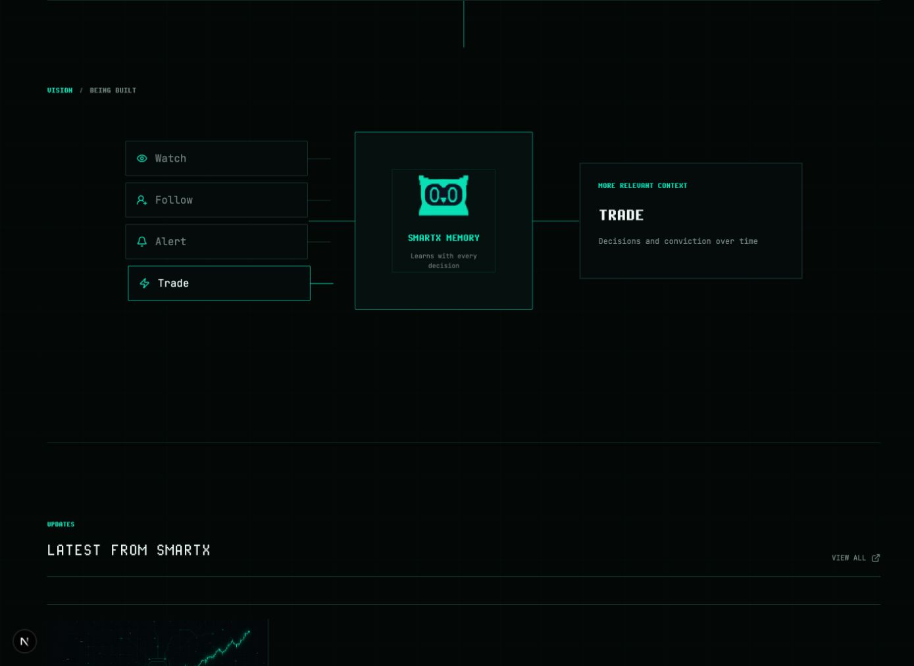
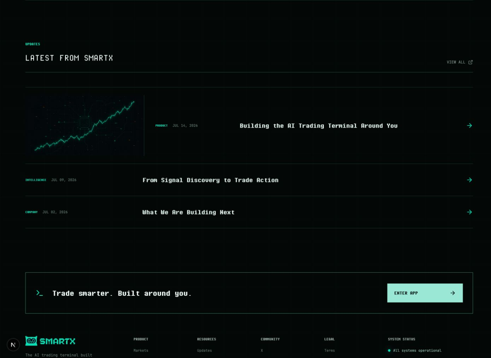
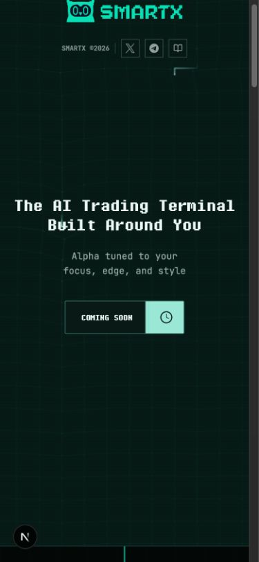
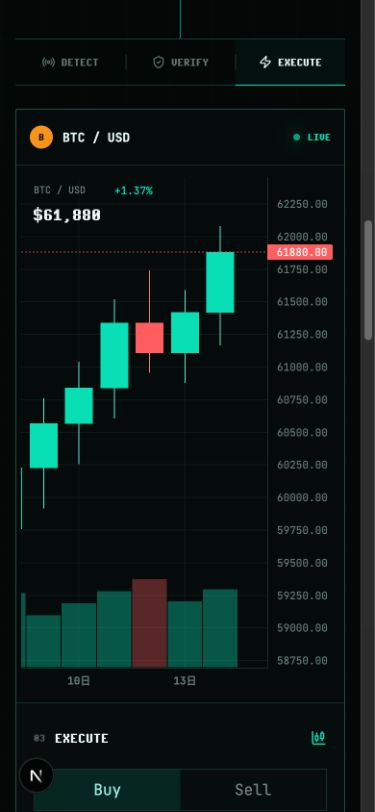

# SmartX 官网质感 Audit

日期：2026-07-14  
范围：当前官网原型的桌面端与移动端，结合 `smartx-fe-dev` 的 `origin/dev` 产品组件做体验、视觉与可访问性启发式审计。  
目标：官网不是产品说明书，而是在第一时间建立「SmartX 有清晰判断、真实产品能力与长期方向」的可信感。

## 总体判断

首屏的品牌识别已经成立，但首屏之后没有延续同一个视觉世界。页面从沉浸式品牌场景，突然切换成静态流程图、手工终端 mock、架构示意图和列表，导致后半段更像一份做了皮肤的产品说明，而不是一个完整、高级、可信的官网体验。

这不是继续微调间距、阴影或边框能解决的问题。需要重做的是首屏之后的叙事载体：让网格、信号、真实产品证据、交易动作和未来 Memory 成为同一条连续的视觉与交互链路。

## 证据屏幕

### 1. 首屏：健康

- 品牌、网格、标题和克制的色彩统一，第一印象明确。
- 视觉焦点稳定，留白有张力。
- 可以保留首屏内容与大部分基础视觉。

### 2. 首屏到价值主张：严重断裂

- 网格在首屏结束时被硬切断，下一屏重新画了一组静态线条。
- `See the move / Know the why / Make the trade` 文案是对的，但现在只是排在一根线上，没有“从市场噪声收敛成可交易判断”的过程。
- 大段黑色区域是静止的空白，不是有节奏的留白。

### 3. 产品展示：真实性与品牌不匹配

- 当前画面像通用加密货币交易终端，不像 SmartX 的预测市场产品。
- `BTC / USD`、通用 K 线和简化订单框削弱了真实感，也没有呈现 Smart Money、Signal evidence、outcome 和 prediction-market trade 这些核心优势。
- Detect、Verify、Execute 同时成为导航、卡片和表单层级，信息重复且平均用力。

### 4. Vision：像架构图，不像愿景

- 左侧四个输入框、中心 Logo 方框、右侧输出框构成了标准流程图。
- 所有节点几乎同权，缺少时间、积累、反馈与个性形成的感觉。
- “Being built” 太弱，当前能力与未来愿景的边界没有成为叙事的一部分。

### 5. Updates 与 Footer：完整但缺少编辑感

- Updates 由边框行组成，特色内容也只是“图片 + 元信息 + 标题”的加长行，仍然是卡片思维。
- 三篇内容全部指向 Medium 首页，像占位内容，会损伤可信度。
- Footer 信息架构有雏形，但 Product 与 Legal 是不可点击文本，硬编码 System status 也可能形成信任风险。

### 6. 移动端：只是桌面端纵向堆叠

- 右侧原生滚动条宽约 15px，在沉浸式暗色页面上非常醒目。
- 产品区先出现整张高 K 线，交易动作被推到后面，移动端无法在一个视野里理解完整决策链。
- 目前没有为移动端重新编排叙事，只是把桌面三栏拆成纵向区块。

## 优先级问题

### P1-01 连续叙事被页面结构切断

`Hero` 和其余内容是两个独立容器，`experience-shell` 还额外增加了一条顶部边框。第二屏的收敛线由静态 CSS 图形重新开始，而不是首屏 Canvas 的延续。

相关实现：

- `src/app/page.tsx:315-326`
- `src/app/globals.css:852-870`
- `src/app/globals.css:892-983`

建议：建立跨越首屏与第二屏的单一滚动场景。网格随滚动沿 Z 轴压缩，透视线向中心坍缩，最终成为一条 signal spine；三句文案按进度依次出现，最后由这条线直接“扫描”出真实产品展示。

### P1-02 产品展示不是 SmartX 产品

当前 `TradingStory` 手工定义了 BTC K 线、阶段文案、证据卡和交易表单。它功能可点，但视觉和产品机制都偏向通用交易终端。

相关实现：

- `src/components/trading-story.tsx:28-68`
- `src/components/trading-story.tsx:173-260`

`smartx-fe-dev` 的 `origin/dev` 已有可作为真实来源的组件：

- `src/app/market/MarketHeader.tsx`
- `src/app/market/MarketChart.tsx` / `PriceChart.tsx`
- `src/app/market/MarketTrade.tsx`
- `src/app/signal/signal-new/pro-ui.tsx` 中的 `SignalProCard`
- `src/app/signal/signal-new/MarketSignalBadges.tsx`
- `src/app/smart-money/components/UserTagIconGroup.tsx`

建议：不要直接跨仓库运行时 import 整个产品页面，也不要复制导航和侧栏。应从真实组件中提取展示所需的 presentational primitives、设计 token 和数据结构，在官网建立一个静态 fixture 驱动的 `ProductShowcase`。展示一个真实 prediction market，并用滚动切换三个状态：Signal 出现、证据展开、Trade panel 接管焦点。

### P1-03 Vision 的表达方式与愿景不匹配

当前 Vision 是按钮列表到中心节点再到输出节点的线性映射，适合解释系统结构，不适合建立对未来产品的想象。

相关实现：

- `src/components/memory-loop.tsx:7-63`
- `src/app/globals.css:1512-1635`

建议：用“行为随时间沉积成个人交易上下文”的动态场表现 Memory。Watch、Follow、Alert、Trade 不是四张卡，而是沿时间留下的事件轨迹；其中 Trade 必须是最高权重事件。事件逐步聚合成用户的 Memory profile，再反向改变下一次 Signal 的排序、解释与交易上下文。必须显式标注这是 Future，并持续与交易闭环相连。

### P2-04 Updates 没有编辑层级

当前所有内容都被统一到横向行中，特色文章没有真正成为视觉锚点。Pixel 字体在长标题和小元信息中使用过多，也让内容更像终端列表。

相关实现：

- `src/app/page.tsx:161-224`
- `src/app/globals.css:1714-1838`

建议：改为非卡片式 editorial feed。第一篇采用一张大幅、无边框的视觉与较大的标题；日期和栏目成为版式坐标；后两篇只保留细线、标题和日期。hover 时让图像或信号轨迹轻微响应，不给整行铺背景。

### P2-05 滚动与动效缺少高级感

当前页面使用浏览器默认纵向滚动条，并对所有 section 套用同一种 `opacity + translateY` 进入动画。动效没有承载产品含义。

相关实现：

- `src/app/globals.css:38-54`
- `src/app/globals.css:879-890`
- `src/components/experience-motion.tsx:5-33`

建议：隐藏滚动条的视觉轨道，但保留原生滚动、键盘、触控和辅助技术行为；不要对 `body` 使用 `overflow: hidden`。用页面中的 signal spine 表达滚动进度。动效只在有语义的节点发生：收敛、检测、证据展开、交易确认、记忆积累。

### P2-06 颜色、字体和边框被单一化

首屏之后几乎所有层级都依靠深绿底、青绿色细线和 Pixel 字体，导致产品、Vision、Updates 看起来属于同一种面板。真实产品使用更完整的 Slate 基底和语义色：primary `#08DFB5`、secondary `#FF5D60`、Smart Money cyan、signal amber/blue/purple。

建议：官网世界保持黑绿品牌感；真实产品 specimen 回到产品自身的 `#0C1322 / #172033 / #1E293B` 基底与语义色。Pixel 字体只用于品牌标题、短标签和状态；产品与 Updates 正文使用更易读的 JB Mono / 正文字体。

### P2-07 移动端需要独立叙事编排

桌面产品区约 939px 高，移动端纵向拆解后更长，用户需要跨多个视口才能把 Signal、Why 和 Trade 关联起来。

建议：移动端用 sticky product viewport 或横向可控的三状态序列；每次只突出一个层级，但始终保留市场标题、outcome 与交易 CTA。Vision 也应从“横向三栏改纵向”升级为一个可持续积累的场景。

### P2-08 占位链接与状态损伤信任

- 三篇 Updates 全部指向 Medium 首页。
- Footer 的 Product 与 Legal 看似导航，实际是 `span`。
- `All systems operational` 是硬编码状态。

相关实现：`src/app/page.tsx:184-222, 253-309`

建议：没有真实 URL 的内容暂不做成可点击导航；Updates 使用真实文章 URL；System status 接真实状态源，或先移除。

## 可访问性风险

- 优点：当前交互控件有 `focus-visible`，Vision 同时支持 hover、focus 和 click，并提供 `prefers-reduced-motion` 降级。
- 风险：大量 10-12px 的低对比文本在暗色背景上可读性不足，尤其 Updates 元信息、Footer 与产品刻度。
- 风险：产品与 Vision 的可见标题被隐藏为 `sr-only`，视觉用户缺少清晰的章节锚点。
- 风险：未来的虫洞/坍缩动效需要提供 reduced-motion 静态版本，避免大范围深度位移和持续视差。
- 限制：本次是启发式审计，没有完成屏幕阅读器、200% zoom 与完整 WCAG 自动化测试，因此不代表合规结论。

## 建议保留与重做

保留：

- 当前首屏内容、网格气质、品牌配色与标题层级。
- `See the move / Know the why / Make the trade` 作为核心决策节奏。
- 真实交互状态、键盘 focus 和 reduced-motion 基础。
- Updates 中“信号轨迹”视觉资产的方向。

重做：

- 首屏之后的全部连续叙事与滚动动效。
- 手工搭建的通用 BTC 终端 mock。
- 卡片/方框式 Vision。
- 横向列表式 Updates。
- 移动端单纯堆叠的产品与 Vision 布局。

## 官网继续设计的基础原则

1. **一个连续世界**：网格、signal spine、产品、Memory 使用同一套空间逻辑，不在 section 边界重置。
2. **产品真相优先**：官网展示态必须来自真实产品组件、真实机制和真实数据结构，只做艺术化编排，不发明另一个产品。
3. **动效必须解释价值**：每个明显动效都对应 Detect、Understand、Trade 或 Learn，不使用统一淡入代替叙事。
4. **一屏一个判断**：每个视口只让用户理解一件事，留白用于节奏与期待，不用于填充静止黑场。
5. **Vision 从交易行为生长**：现阶段是 B，未来走向 C，但 C 必须由真实交易与行为积累驱动。
6. **编辑感代替卡片感**：品牌官网允许不对称、跨栏、大图与基线排版；边框只用于真实产品 UI 或必要控件。
7. **桌面与移动端分别导演**：共享内容和状态，不共享僵硬布局。

## 推荐重构顺序

1. 保留首屏，建立 `Hero -> Thesis` 的统一 Canvas/scroll timeline。
2. 从 `smartx-fe-dev` 提取真实产品展示组件与 token，替换 `TradingStory`。
3. 用交易行为沉积的动态 Memory field 重做 Vision。
4. 重排 Updates 为 editorial feed，再收敛 CTA 与 Footer。
5. 单独完成移动端分镜、reduced-motion 和可访问性验证。

## 页面步骤健康度

1. **Hero**：健康，可保留并微调滚动出口。
2. **Hero -> Thesis**：严重，需要重构连续场景。
3. **Product showcase**：严重，需要替换为真实产品组件组合。
4. **Vision**：严重，需要重做视觉隐喻与交互机制。
5. **Updates / Footer**：中等，需要编辑化与真实链接。
6. **Mobile flow**：严重，需要独立分镜而非纵向堆叠。
