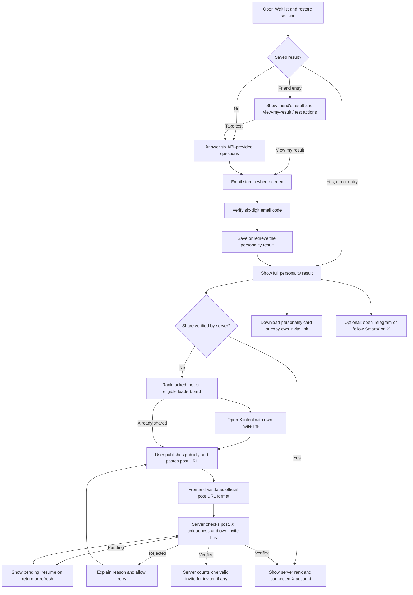

# Waitlist flow · 2026-09-09

Current confirmed flow. Integration details and backend dependencies are in [the share verification handoff](./waitlist-share-verification.md).

## Entry and authentication

- Direct entry does not require an invitation. Valid friend links prefill the inviter relationship.
- Logged-in visitors to a friend's link still see the friend's public persona first and retain a way to view their own result.
- Quiz drafts, OTP auto-submit at six digits, manual retry, resend, changing email, result recovery and sign-out remain available.
- Once the email is verified and a result exists, neither community flags nor share status block the personality result.
- In normal mode, an older backend withholding personality data produces an unavailable/retry state. The explicitly authorized local-only prototype bridge (2026-09-10) may mark missing legacy community tasks complete on the test backend, then fetch the real card. It never fabricates results or verifies a share; see the handoff for the guarded opt-in.

## Sharing and eligibility

- Opening intent is only starting a share. It never awards Boost, binds X or unlocks a rank.
- The return-link dialog can be reopened without reposting. It supports invalid URL, submitting, pending, rejection and verified states.
- Only server-confirmed verification counts. Legacy `shareCompleted` is not proof of verification.
- Unverified users are excluded from the eligible leaderboard by the backend, not merely hidden by frontend styling.
- A verified post binds the actual author's stable X user ID for this activity; no OAuth or X-based login is introduced.
- Ranking and verified invitation counts are server values. No local score or invitation increments.
- If B joined via A, B posts **B's** invite link; after B verifies, the server credits A once.
- Telegram / follow-X actions are optional outbound links. Clicking them is not presented as verified membership or following.

## Backend readiness

The post-verification endpoint and response are awaiting backend confirmation. See the handoff before setting `NEXT_PUBLIC_WAITLIST_SHARE_VERIFY_PATH`. The default frontend does not call an invented endpoint or the old share-completion endpoint.
