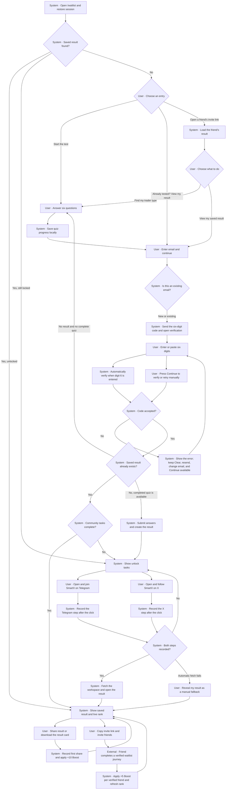

# Waitlist flow

This document describes the current waitlist journey and distinguishes explicit user actions from automatic product behavior.

## Legend

- **User**: the person must click, type, choose, or return to continue.
- **System**: the product performs the step automatically after a user action or when the page opens.
- **External**: Telegram, X, email, or the native share surface is opened outside SmartX.

## End-to-end flow

## Steps that require the user to advance

1. Choose **Start the test** or **Already tested? View my result**.
2. Answer all six questions.
3. Enter an email and press **Continue** or **Send code**.
4. Enter or paste the six-digit code. Automatic verification is the primary path; **Continue** remains the manual trigger and retry path.
5. If needed, use **Clear**, **Resend code**, or **Change email**.
6. Open Telegram and X and complete the two community actions externally.
7. If the automatic transition after the second community task fails, press **Reveal my result** as a manual fallback.
8. Optionally share or download the result, or copy the invite link.

## Steps the system performs automatically

1. Restore the saved session, quiz draft, invite, and result when the page opens.
2. Fetch the current questions and decide the correct entry stage.
3. Recognize an existing email, send the verification code, and move directly to verification.
4. Submit verification automatically when the sixth digit is entered, while preserving the manual **Continue** fallback.
5. Create or retrieve the result after sign-in and route to unlock or result.
6. After the second community task is recorded, fetch the workspace and open the result automatically.
7. Record first-share Boost, verified-friend Boost, and refresh live rank.
